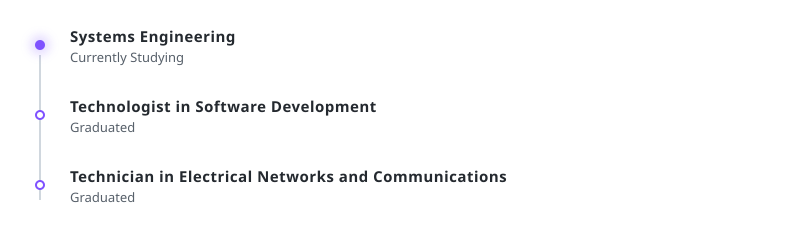

<!-- ═══════════════════════════════════════════════════════════════════ -->
<!--                            HEADER                                -->
<!-- ═══════════════════════════════════════════════════════════════════ -->

<picture>
  <source media="(prefers-color-scheme: dark)" srcset="./assets/header-dark.svg">
  
</picture>

  

<!-- ═══════════════════════════════════════════════════════════════════ -->
<!--                          TECH STACK                              -->
<!-- ═══════════════════════════════════════════════════════════════════ -->

  

  <picture>
    <source media="(prefers-color-scheme: dark)" srcset="./assets/title-tech-dark.svg">
    
  </picture>

  &nbsp;
  &nbsp;
  &nbsp;
  
   
  &nbsp;
  &nbsp;
  
   
  &nbsp;
  &nbsp;
  

<!-- ═══════════════════════════════════════════════════════════════════ -->
<!--                          BACKGROUND                              -->
<!-- ═══════════════════════════════════════════════════════════════════ -->

  

  <picture>
    <source media="(prefers-color-scheme: dark)" srcset="./assets/title-background-dark.svg">
    
  </picture>

  <picture>
    <source media="(prefers-color-scheme: dark)" srcset="./assets/education-dark.svg">
    
  </picture>

 

  <picture>
    <source media="(prefers-color-scheme: dark)" srcset="./assets/collab-dark.svg">
    
  </picture>

<!-- ═══════════════════════════════════════════════════════════════════ -->
<!--                      FEATURED PROJECTS                           -->
<!-- ═══════════════════════════════════════════════════════════════════ -->

  

  <picture>
    <source media="(prefers-color-scheme: dark)" srcset="./assets/title-projects-dark.svg">
    
  </picture>

 

<table width="100%" border="0" cellpadding="12" cellspacing="0">
  <tr>
    <td width="45%" valign="top">
      <picture>
        <source media="(prefers-color-scheme: dark)" srcset="./assets/project1-title-dark.svg">
        
      </picture>
        
      
An enterprise-grade, microservices-based platform for AI-assisted certificate generation, built to automate certificate creation and streamline associated data management.

      

        
        
        
        
        
        
        
      

      
    </td>
    <td width="55%" align="center" valign="middle">
      
      
      
    </td>
  </tr>
</table>

 

<table width="100%" border="0" cellpadding="12" cellspacing="0">
  <tr>
    <td width="45%" valign="top">
      <picture>
        <source media="(prefers-color-scheme: dark)" srcset="./assets/project2-title-dark.svg">
        
      </picture>
        
      
A full-stack web application replicating the core features and UI of Crunchyroll, built to showcase frontend architecture and media streaming layouts.

      

        
        
        
        
      

      
    </td>
    <td width="55%" align="center" valign="middle">
      
      
      
    </td>
  </tr>
</table>

<!-- ═══════════════════════════════════════════════════════════════════ -->
<!--                        GITHUB STATS                              -->
<!-- ═══════════════════════════════════════════════════════════════════ -->

  <picture>
    <source media="(prefers-color-scheme: dark)" srcset="./assets/title-stats-dark.svg">
    
  </picture>

  <picture>
    <source media="(prefers-color-scheme: dark)" srcset="https://streak-stats.demolab.com?user=juda-dev&background=0d1117&border=21262d&ring=7F52FF&fire=ED8B00&currStreakLabel=e6edf3&sideLabels=8b949e&dates=8b949e&currStreakNum=e6edf3&sideNums=e6edf3&border_radius=10">
    
  </picture>

